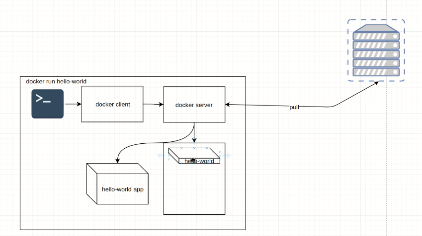
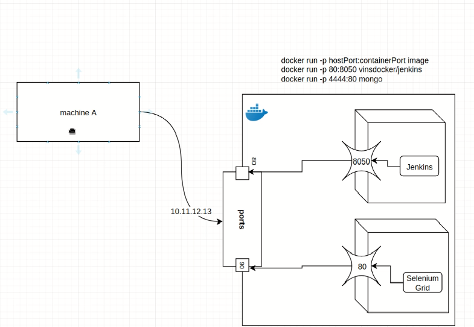
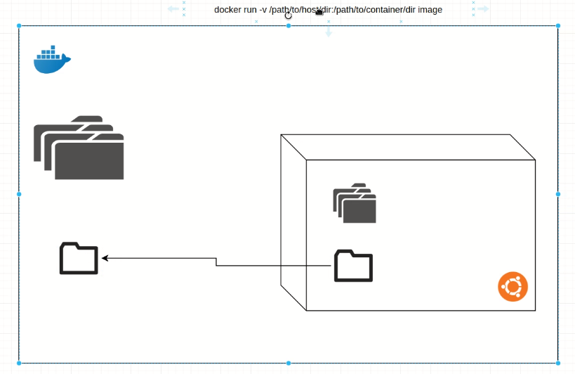
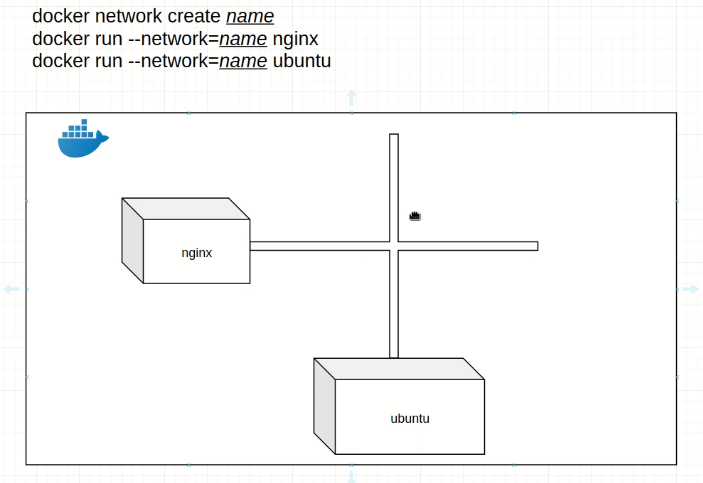

| Docker      | Description |Java Terminology|
| ----------- | ----------- |----------|
| Dockerfile      | Title       |Java|
| Paragraph   | Text        ||

 *Basic Docker*

 *Port Mapping*

 *Volume Mapping*

 *Docker Network*

 *Docker Image*